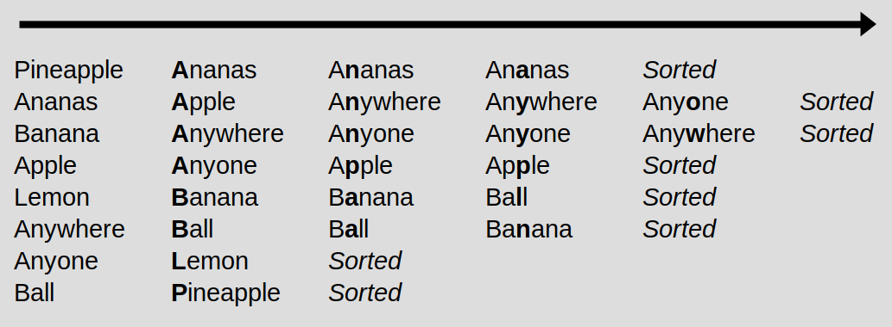
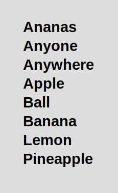
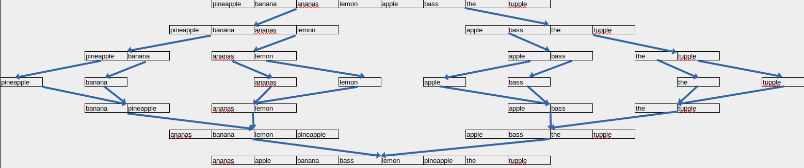
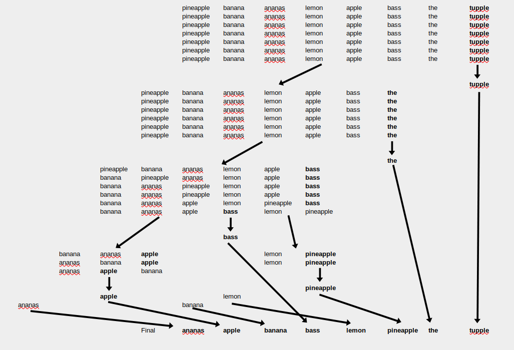

# sortpy

More information about this challenge here:
https://codingchallenges.fyi/challenges/challenge-sort/

Basically this code tries to implement same functionalities as sort tool. I use python here because I want to learn it more.

Install python to run this code

## How to run

```
// Basic lexicographic sort
// This might take long because on inefficient algorithm
python3 main.py words.txt | uniq | head -n5

// Basic lexicographic sort with the -u (unique) option
python3 main.py -u words.txt | head -n5

// Radix radix sort with the -u (unique) option
python3 main.py -u sort=radix words.txt | head -n5

// Radix merge sort with the -u (unique) option
python3 main.py -u sort=merge words.txt | head -n5

// Run unit tests
python3 -m unittest test.py
```

## Radix sort

Radix sort, a non-comparative sorting algorithm that avoids comparison by placing elements of sorting into buckets according their radix.
Bucketing will be done for each character along the way and sorting the elements by their current radix (or character for words).

I implemented MSD radix sort, so I start with most significant digit and work the elements to the least significant digit. This is because I read that LSD (least significant digit) sorting will work well when you have same length words. My test data words are in different lengths.





## Merge sort

Merge sort is comparison-based sorting algorithm. It is divide-and-conquer algorithm (that breaks a problem into sub-problems to simplify the needed solution). Merge sort is efficient and general-purpose.



## Quick sort

Quick sort is efficient general-purpose sorting algorithm. Like merge sort the quick sort is divide-and-conquer algorithm. It is said to be slightly faster than merge sort or heap sort with randomized data.

I implemented the quick sort with pivot that is last element in word array. I chose to do that because it was very common way to implement the quick sort algorithm.

