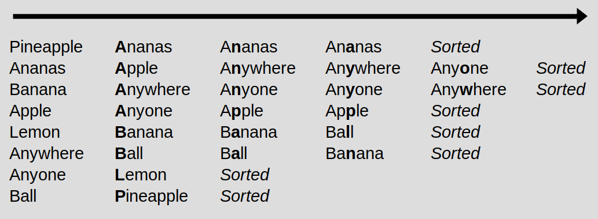
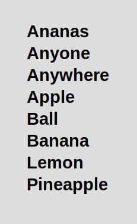
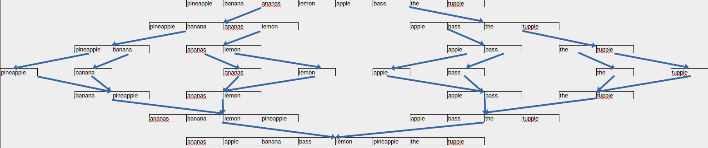
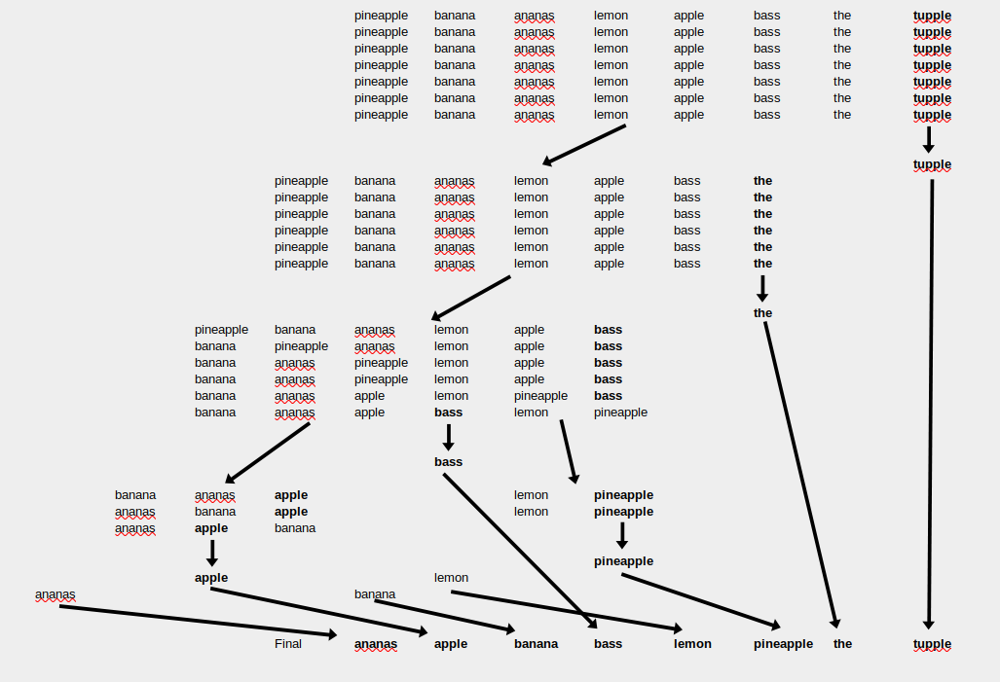
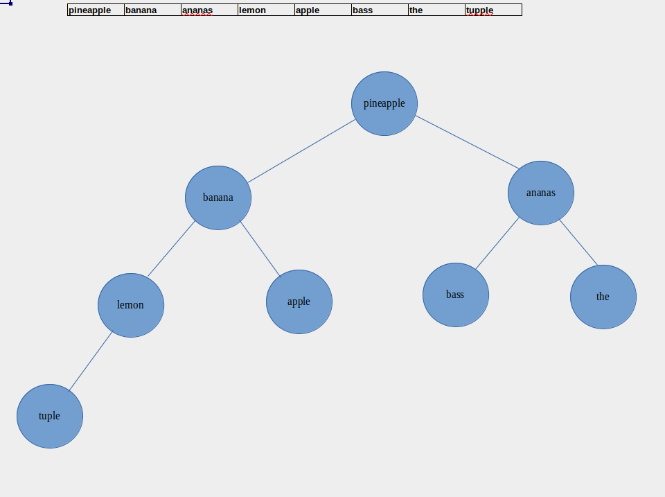
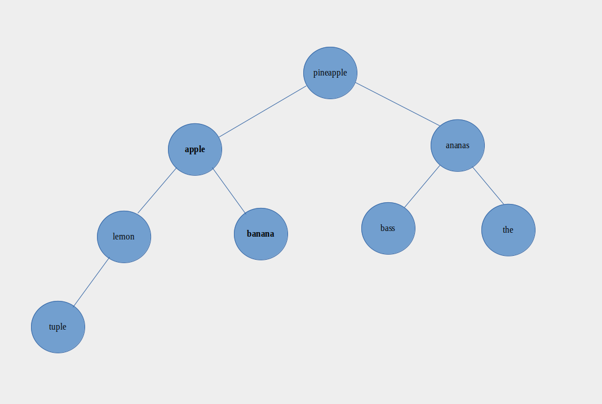
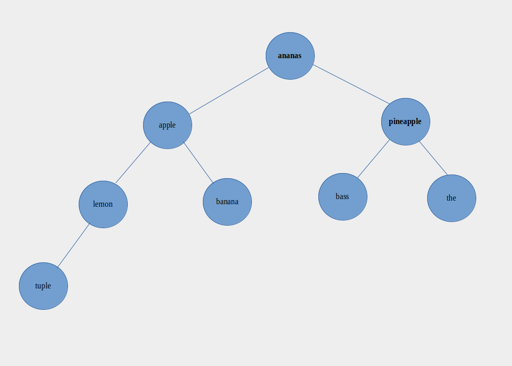
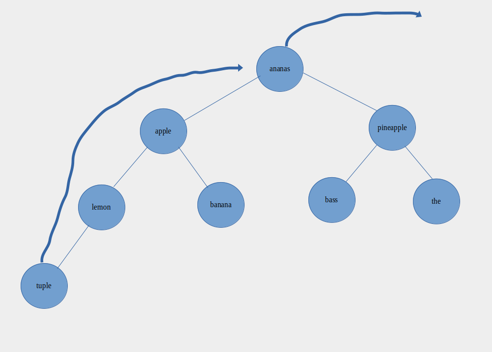
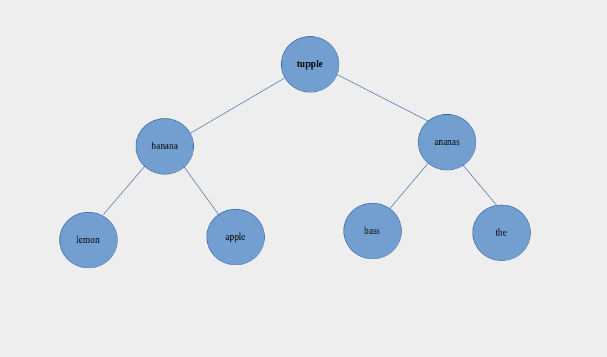
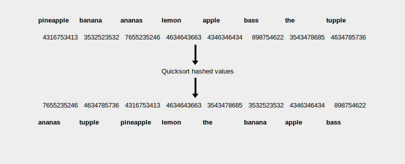

# sortpy

More information about this challenge here:
https://codingchallenges.fyi/challenges/challenge-sort/

Basically this code tries to implement same functionalities as sort tool. I use python here because I want to learn it more.

Install python to run this code

## How to run

```
// Basic lexicographic sort
// This might take long because on inefficient algorithm
python3 main.py words.txt | uniq | head -n50

// Basic lexicographic sort with the -u (unique) option
python3 main.py -u words.txt | head -n50

// Radix sort with the -u (unique) option
python3 main.py -u sort=radix words.txt | head -n50

// Merge sort with the -u (unique) option
python3 main.py -u sort=merge words.txt | head -n50

// Quick sort with the -u (unique) option
python3 main.py -u sort=quick words.txt | head -n50

// Heap sort with the -u (unique) option
python3 main.py -u sort=heap words.txt | head -n50

// Random sort with the -u (unique) option
python3 main.py -u sort=random words.txt | head -n50

// Basic lexicographic sort with the -u (unique) option and -ct (capture time) option
python3 main.py -u -ct words.txt | head -n50

// Run unit tests
python3 -m unittest test.py
```

## Elapsed time in sorting with different algorithms

```
Merge with unique
Elapsed time in sorting was: 768.2 milliseconds

Quick with unique
Elapsed time in sorting was: 792.917 milliseconds

Random with unique (quick sort)
Elapsed time in sorting was: 1110.4460000000001 milliseconds

Default comparative algorithm with unique
Elapsed time in sorting was: 9081.626 milliseconds

Heap with unique
Elapsed time in sorting was: 14676.664 milliseconds

Radix with unique
Elapsed time in sorting was: 15633.761 milliseconds
```

## To Do

Code does the minimum what was required at the moment but there are some things that could be implemented in future.

* More test cases (for example. larger data, different data)
* Make code more readable (refactor larger functions, place certain parts to own files)
* Elapsed time testing without unique -u option
* Unique option -u always removed to unique characters before sorting, should it always be first thing to do?
* Implemented other algorithms to the tool

These tasks are things that could be implemented later on for learning purpose.

## Radix sort

Radix sort, a non-comparative sorting algorithm that avoids comparison by placing elements of sorting into buckets according their radix.
Bucketing will be done for each character along the way and sorting the elements by their current radix (or character for words).

I implemented MSD radix sort, so I start with most significant digit and work the elements to the least significant digit. This is because I read that LSD (least significant digit) sorting will work well when you have same length words. My test data words are in different lengths.





## Merge sort

Merge sort is comparison-based sorting algorithm. It is divide-and-conquer algorithm (that breaks a problem into sub-problems to simplify the needed solution). Merge sort is efficient and general-purpose.

Simply the merge sort divides the sortable items and stops dividing when there is nothing to divide anymore (list lengths are 1). Then the items are rearranged in right order.



## Quick sort

Quick sort is efficient general-purpose sorting algorithm. Like merge sort the quick sort is divide-and-conquer algorithm. It is said to be slightly faster than merge sort or heap sort with randomized data.

Choose the pivot and then compare the other elements to pivot starting for the start of the list. If the comparable item is less than the pivot, then increment the counter that start from -1 index and swap item with incremented counter index with the item that was compared to pivot. After going through the list, lastly increment the counter once ore and swap the item with the pivot. Divide list with the pivot and do same until there is nothing to sort anymore and rearrange list with the new order.

I implemented the quick sort with pivot that is last element in word array. I chose to do that because it was very common way to implement the quick sort algorithm.



## Heap sort

Heap sort is comparison-based sorting algorithm. Heap sort divides the array into a sorted and an unsorted. It iteratively shrink the unsorted array by extracting the current largest item from it and placing it to sorted array.

List of words is turned to tree model and the tree is max heapified to get the first word in lexicographic order to root node and then added to sorted array. This process is repeated until no nodes are left to unsorted array.

Here are some formulas used in tree model:

```
# lastNonLeafNodeIndex = math.floor((maxLength) / 2 - 1)
# leftNodeIndex: int = 2 * i + 1
# rightNodeIndex: int = 2 * i + 2
# parentNodeIndex = (i - 1) / 2
```






And the process starts again..

## Random sort

Random sort algorithm is very basic. The original list of sortable items are hashed in same order than original list. It is important to save original lists to memory so we can perform the dehashing operation to the random sorted list after, because otherwise we end up having gibberish items.

I used hash function with alternative random value added to the hash to make it "more random". I used quick sort algorithm to sort the hashed items.


